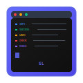

<div align="center">
  
  
  # Sherman Logger

  A lightweight, chainable, and cross-platform logging solution for modern JavaScript applications
</div>

`Logger` is a lightweight logging library that allows custom log styles and tags. It provides some predefined log types
and supports the dynamic creation of new log types.


English | [简体中文](./README.zh-CN.md)

# Features

- Multiple predefined log types (info, warn, error, debug, success, failure, plain)
- Custom log type styles
- Log tags
- Log prepend and append dividers
- Displaying log time
- Dynamic creation of custom log types
- Interactive spinner-based logging with `StreamLogger`
- **🌐 Browser Console Support** - Works seamlessly in both Node.js and browser environments
- **🎨 Cross-Platform Styling** - Automatic environment detection with appropriate styling

## Browser Support

Sherman Logger now supports browser environments! The library automatically detects the environment and provides appropriate styling:

### Node.js Environment

- Uses `chalk` for terminal colors and styling
- Uses `ora` for interactive spinners
- Full feature support

### Browser Environment

- Uses CSS styling for console output
- Provides visual feedback for stream operations
- Maintains API compatibility

### Usage Example

```javascript
import { Logger } from '@shermant/logger'

// Works in both Node.js and browser
Logger.info.text('Hello World!').print()
Logger.success.text('Operation completed').print()

// Stream logging with cross-platform support
const stream = Logger.stream
stream.text('Processing...').update()
stream.text('Done!').state('succeed')
```

## Docs

Please visit docs webpage for more information.

- [Index](https://shermantsang.github.io/x-logger)
- [API & Usages](https://shermantsang.github.io/x-logger/basic.html)
- [Roadmap](https://shermantsang.github.io/x-logger/roadmap.html)
